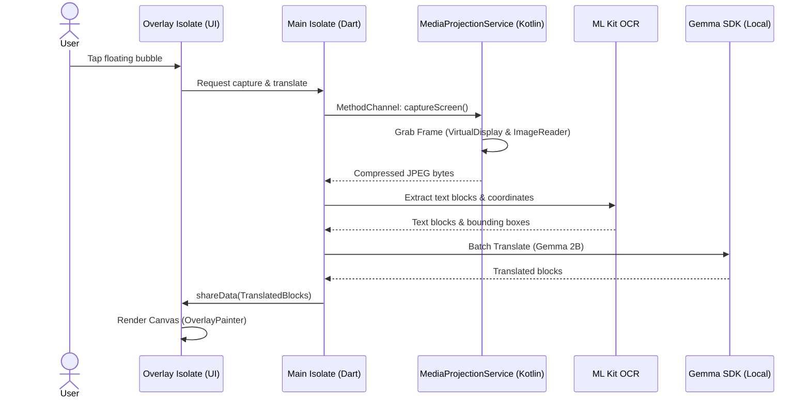

# Translatto — Screen Translator

Flutter + Kotlin Android app. Captures screen → OCR → local Gemma translation → AR overlay.

## Commands

```bash
make push-model DEVICE_ID=<device_id>   # Push Gemma model to device
make debug DEVICE_ID=<device_id>        # Run in debug mode
make release                             # Build release APK
make install-release DEVICE_ID=<device_id> # Install release APK
flutter test                             # Run test suite
flutter analyze                          # Static analysis
```

Device ID defaults to `a03cc3eb` in Makefile. Override per invocation.

## Architecture



### Files

| File | Role |
|------|------|
| `lib/main.dart` | Entry point, main dashboard, overlay window screens |
| `lib/ocr_service.dart` | Google ML Kit text recognition, block extraction, merging |
| `lib/translation_service.dart` | Gemma inference sessions, XML batch prompts, translation cache |
| `lib/capture_service.dart` | MethodChannel bridge to Kotlin for screen capture |
| `lib/overlay_painter.dart` | CustomPainter for AR translation overlay with collision adjustment |
| `lib/overlay_bridge.dart` | IPC bridge between main isolate and overlay isolate |
| `android/.../MainActivity.kt` | Method channel handlers, overlay requests, projection permissions |
| `android/.../MediaProjectionService.kt` | Foreground service, VirtualDisplay, ImageReader frame capture |

## Gotchas

1. **Android 14+ Foreground Service**: FGS type `mediaProjection` must be declared in manifest and started *after* displaying notification, otherwise `SecurityException`.
2. **Isolate Plugin Bindings**: Flutter plugins (Gemma, ML Kit) crash on background/overlay isolates — no platform channel bindings exist there. Heavy ML runs on main isolate; overlay receives layouts via bridge.
3. **Battery Optimization**: Background capture requires ignoring battery optimization. Trigger via `REQUEST_IGNORE_BATTERY_OPTIMIZATIONS`.
4. **Repaint Avoidance**: CustomPainter repaints only if `TranslatedBlock` coordinates or counts differ (overridden `==` and `hashCode`). Repaints are the main perf bottleneck.
5. **Dynamic Font Sizing**: Translated text rendered at `(scaledLineHeight * 0.70).clamp(8.0, 48.0)` using original text's line split count to fit target height.

## Prerequisites

- Flutter SDK 3.22+
- Android SDK API 30+
- Android device supporting MediaProjection
- Gemma model file (`gemma-4-E2B-it.litertlm`) on host for push-model

## Codegraph

This repo has a `.codegraph/` index. Use `codegraph_explore` or `mcp__codegraph__codegraph_explore` for code questions — returns verbatim source + call paths.
