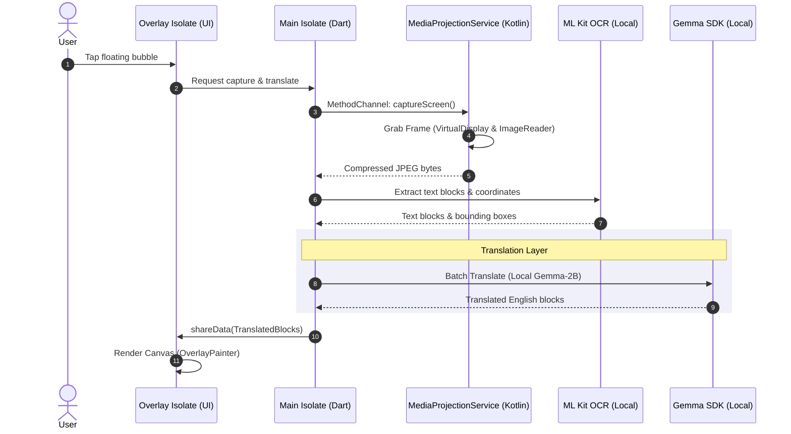

# Translatto 📱

> **Translatto** is a hybrid Android screen translator built with Flutter and Kotlin. It captures your screen, runs OCR, and overlays context-aware translations directly on top of target text in real-time.

---

## 🏗️ System Architecture

Translatto uses a hybrid multi-isolate pipeline to achieve high performance while respecting Android sandboxing and threading requirements:



### Key Architectural Constraints
1. **Foreground Service (`mediaProjection`)**: Recreates frame captures instantly via active `ImageReader` buffers without triggering OS permission dialogs repeatedly.
2. **Isolate Isolation**: Flutter native plugins (Gemma, ML Kit) require platform channels bound to the main isolate. Deep translation work occurs on the main thread, while the overlay isolate remains a lightweight rendering canvas via `shareData()`.
3. **Repaint Avoidance**: [OverlayPainter](file:///Users/haikalannisa/Documents/Code/screen-translate/lib/overlay_painter.dart) repaints are expensive. Coordinates are cached and repaint triggers only if block positions or hashes change.

---

## ⚠️ Pain Point: Local Translation Quality vs. Online Access

Currently, Translatto uses a **local offline Gemma 2B model** via `flutter_gemma`. 

### Current Limitations:
* **Low Context Awareness**: 2B parameter models struggle with nuance, idioms, and multi-sentence context.
* **Token Constraints**: The KV-cache on mobile is restricted (configured at `maxTokens: 256` to avoid graphics OOM), preventing the inclusion of large translation histories.
* **CPU/GPU Thermal Overhead**: Running continuous local LLM inference drains battery and heats mobile devices.

### 🌐 The Solution: Online API Translation Roadmap
To resolve this, we are transitioning to a **Hybrid Translation Architecture**. This will allow the app to automatically fall back to high-quality online APIs (e.g., Gemini API, OpenAI, or DeepL) when internet is available, keeping local Gemma as an offline fallback.

#### Proposed `TranslationEngine` Interface:
```dart
abstract class TranslationEngine {
  Future<void> initialize();
  Future<List<String>> translateBatch(List<String> texts, {required String sourceLang, required String targetLang});
  Future<void> dispose();
}
```

#### Proposed Configurations:
* **Gemini API Engine**: Sends batch JSON payloads to `gemini-1.5-flash` or `gemini-2.5` for high-context, ultra-fast translations.
* **Local Gemma Engine**: Fallback engine used only when offline or specified by settings.

---

## 🛠️ Getting Started

### Prerequisites
* Flutter SDK (3.22+)
* Android SDK (API 30+)
* Android Device/Emulator supporting MediaProjection

### Setup & Model Push
1. Place your LiteRT-LM model (`gemma-4-E2B-it.litertlm`) on your host machine.
2. Push the model to the application's private directory:
   ```bash
   make push-model DEVICE_ID=<device_id>
   ```

### Build & Run Commands

| Command | Action |
| :--- | :--- |
| `make debug DEVICE_ID=<device_id>` | Runs app in debug mode on connected device |
| `make release` | Compiles a production release APK |
| `make install-release DEVICE_ID=<device_id>` | Installs built release APK |
| `flutter test` | Runs unit and widget test suites |
| `flutter analyze` | Runs static code analysis |

---

## 📂 Codebase Reference Map

* 🖥️ **Main Dashboard & Overlay UI**: [lib/main.dart](file:///Users/haikalannisa/Documents/Code/screen-translate/lib/main.dart)
* 👁️ **Text Recognition (OCR)**: [lib/ocr_service.dart](file:///Users/haikalannisa/Documents/Code/screen-translate/lib/ocr_service.dart)
* 🧠 **Local Inference Management**: [lib/translation_service.dart](file:///Users/haikalannisa/Documents/Code/screen-translate/lib/translation_service.dart)
* 📸 **Kotlin Media Projection Service**: [MediaProjectionService.kt](file:///Users/haikalannisa/Documents/Code/screen-translate/android/app/src/main/kotlin/id/web/noxymon/translatto/MediaProjectionService.kt)
* 🎨 **AR Overlay Painting Logic**: [lib/overlay_painter.dart](file:///Users/haikalannisa/Documents/Code/screen-translate/lib/overlay_painter.dart)
